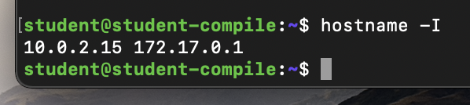

## Contents

1. [Part 1. Установка ОС](#part-1-установка-ос)
2. [Part 2. Создание пользователя](#part-2-создание-пользователя)
3. [Part 3. Настройка сети ОС](#part-3-настройка-сети-ос)
4. [Part 4. Обновление ОС](#part-4-обновление-ос)
5. [Part 5. Использование команды sudo](#part-5-использование-команды-sudo)
6. [Part 6. Установка и настройка службы времени](#part-6-установка-и-настройка-службы-времени)
7. [Part 7. Установка и базовая настройка сервиса SSHD](#part-7-установка-и-базовая-настройка-сервиса-sshd)
8. [Part 8. Установка и использование утилит top, htop](#part-8-установка-и-использование-утилит-top-htop)
9. [Part 9. Использование утилиты fdisk](#part-9-использование-утилиты-fdisk)
10. [Part 10. Использование утилиты df](#part-10-использование-утилиты-df)
11. [Part 11. Использование утилиты du](#part-11-использование-утилиты-du)
12. [Part 12. Установка и использование утилиты ncdu](#part-12-установка-и-использование-утилиты-ncdu)
13. [Part 13. Работа с системными журналами](#part-13-работа-с-системными-журналами)
14. [Part 14. Использование планировщика заданий CRON](#part-14-использование-планировщика-заданий-cron)

## Part 1. Установка ОС
### Установить **Ubuntu 20.04 Server LTS** без графического интерфейса
Узнайть версию Ubuntu: 
```
cat /etc/issue
```


## Part 2. Создание пользователя

### 2.1. Создать пользователя, отличного от пользователя, который создавался при установке
Добавить нового пользователя:
```
sudo adduser newuser
```


### 2.2. Пользователь должен быть добавлен в группу `adm`
Добавить в группу `adm`:
```
sudo usermod -a -G adm newuser
```
Проверить статус группы:
```
id newuser
```
## Part 3. Настройка сети ОС

### 3.1. Задать название машины вида user-1 
Изменить имя:
```
sudo vim /etc/hostname
```
Проверить текущее имя:
```
cat /etc/hostname
```


### 3.2. Установить временную зону, соответствующую вашему текущему местоположению
```
sudo timedatectl set-timezone Etc/GMT-7
```
Проверить временную зону:
```
timedatectl show
```


### 3.3. Вывести названия сетевых интерфейсов с помощью консольной команды
```
ifconfig -a
```


`lo (loopback device)` – виртуальный интерфейс, присутствующий по умолчанию в любом Linux. Он используется для отладки сетевых программ и запуска серверных приложений на локальной машине. С этим интерфейсом всегда связан адрес 127.0.0.1. У него есть dns-имя – localhost. Посмотреть привязку можно в файле /etc/hosts.
### 3.4. Используя консольную команду получить ip адрес устройства, на котором вы работаете, от DHCP сервера
```
hostname -I
```
ip адрес: 10.0.2.15 172.17.0.1



`DHCP (англ. Dynamic Host Configuration Protocol — протокол динамической настройки узла)` — сетевой протокол, позволяющий сетевым устройствам автоматически получать IP-адрес и другие параметры, необходимые для работы в сети TCP/IP. Данный протокол работает по модели «клиент-сервер». Для автоматической конфигурации компьютер-клиент на этапе конфигурации сетевого устройства обращается к так называемому серверу DHCP и получает от него нужные параметры.
### 3.5. Определить и вывести на экран внешний ip-адрес шлюза (ip) и внутренний IP-адрес шлюза, он же ip-адрес по умолчанию (gw)
```
curl ident.me: 178.23.151.201
ip route | grep default: 10.0.2.2
```


### 3.6. Задать статичные (заданные вручную, а не полученные от DHCP сервера) настройки ip, gw, dns
```
sudo vim /etc/netplan/00-installer-config.yaml
```


### 3.7. Перезагрузить виртуальную машину. Убедиться, что статичные сетевые настройки (ip, gw, dns) соответствуют заданным в предыдущем пункте
```
restart ubuntu: reboot
ping -c 2 1.1.1.1
ping -c 2 ya.ru
```


## Part 4. Обновление ОС

### Обновить системные пакеты до последней на момент выполнения задания версии
```
sudo apt-get upgrade
```


## Part 5. Использование команды **sudo**
### Разрешить пользователю, созданному в Part 2, выполнять команду sudo
```
sudo usermod -a -G sudo newuser
```
Сменить пользователя:
```
su newuser
```
Изменить имя:
```
sudo vim /etc/hostname
```
Проверить имя:
```
cat /etc/hostname
```


`sudo (substitute user and do — дословно «подменить пользователя и выполнить»)` - команда sudo предоставляет возможность пользователям выполнять команды от имени суперпользователя root, либо других пользователей. В большинстве случаев грамотная настройка sudo делает небезопасную работу от имени суперпользователя ненужной. Все действия оказываются выполнимы из-под аккаунта пользователя, которому разрешено использовать sudo без ограничений. Имеется возможность запрещать и разрешать определённым пользователям или группам выполнение конкретного набора программ, а также разрешить выполнение определённых программ без необходимости ввода своего пароля.

## Part 6. Установка и настройка службы времени
### Настроить службу автоматической синхронизации времени
Посмотреть:
```
timedatectl show
```
Установить пакет синхронизации времени ntp:
```
sudo apt-get install ntp
```


## Part 7. Установка и базовая настройка сервиса **SSHD**
### 7.1 Установить службу SSHd
```
sudo apt update
sudo apt-get install ssh
sudo apt install openssh-server
```
### 7.2 Добавить автостарт службы при загрузке системы
```
sudo systemctl start ssh
sudo systemctl status ssh
sudo systemctl enable ssh
```


### 7.3 Перенастроить службу SSHd на порт 2022
```
sudo vim /etc/ssh/sshd_config
```
Сделать рестарт:
```
sudo systemctl restart sshd 
```
Либо так:
```
sudo service sshd restart
```


### 7.4 Используя команду ps, показать наличие процесса sshd. Для этого к команде нужно подобрать ключи
```
ps -A | grep sshd
```


Вывод команды netstat -tan должен содержать  
`tcp 0 0 0.0.0.0:2022 0.0.0.0:* LISTEN`
```
netstat - tan
```


```
-t: отображение только TCP-портов
-a: отображение всех открытых портов (как TCP, так и UDP)
-n: отображение портов в числовом формате, без имен хостов и сервисов

- Proto: тип протокола (TCP или UDP)
- Recv-Q: количество байт, которые находятся в буфере приема сокета
- Send-Q: количество байт, которые находятся в буфере отправки сокета
- Local Address: локальный IP-адрес и порт, связанный с соединением
- Foreign Address: удаленный IP-адрес и порт, связанный с соединением
- State: текущее состояние соединения (например, ESTABLISHED, LISTENING, WAITING)
```
## Part 8. Установка и использование утилит **top**, **htop**
### 8.1 Установить и запустить утилиты top и htop
```
sudo apt install -y top htop
```


### 8.2 info top
  - uptime: 2:47
  - количество авторизованных пользователей: 1
  - общую загрузку системы: 0.05
  - общее количество процессов: 113
  - загрузку cpu: 0.0
  - загрузку памяти: 256.6
  - pid процесса занимающего больше всего памяти : 1799
  - pid процесса, занимающего больше всего процессорного времени: 1799

  

### 8.3 info htop


## Part 9. Использование утилиты **fdisk**
### Запустить команду fdisk -l
```
sudo fdisk -l
```


- название жесткого диска: sda
- размер: 16 GB
- количество секторов: 33554432
- swap: 0


## Part 10. Использование утилиты **df**
### 10.1 Запустить команду df


- размер раздела 16445308
- размер занятого пространства 5564484
- размер свободного пространства 10025736
- процент использования 36%
- единица измерения в выводе: Кбайты
### 10.2 Запустить команду df -Th


- размер раздела 17G
- размер занятого пространства 5.7G
- размер свободного пространства 11G
- процент использования 36%
тип файловой системы для раздела: ext4

## Part 11. Использование утилиты **du**
### 11.1 Вывести размер папок /home, /var, /var/log (в байтах, в человекочитаемом виде)


### 11.2 Вывести размер всего содержимого в /var/log


## Part 12. Установка и использование утилиты **ncdu**
### Вывести размер папок /home, /var, /var/log


## Part 14. Работа с системными журналами
- Время последней успешной авторизации: 01:34
- Имя пользователя: student
- Метод входа в систему: student


## Part 14. Использование планировщика заданий **CRON**


```
sudo apt-get cron
```
Открыть файл:
```
crontab -e
```
Найти в системных журналах строчки (минимум две в заданном временном диапазоне) о выполнении:
```
cat /var/log/syslog | grep uptime
```
Удалите все задания из планировщика заданий


